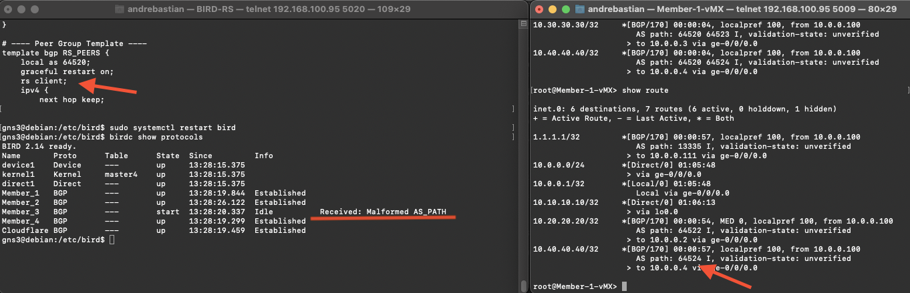

# BIRD 2.14 Route Server Internet Exchange Point
This document explains how a Debian Linux system running BIRD 2.14 can be used as a Route Server (RS) to simplify peering at an Internet Exchange Point (IXP). The topology is reused from a previous FRR RS project and I just replace FRR with BIRD as a Route Server.

---

## Topology


---

## BIRD Configuration
There is step to configure Linux Debian with BIRD 2.14 as a Route Server

---

### 1. Configure interface IP address
Location: /etc/network/interfaces

```ini
auto eth0
iface eth0 inet static
    address 10.0.0.100
    netmask 255.255.255.0
```

Apply the change by bringing the interface down and up or restarting networking:

```bash
sudo ifdown eth0 && sudo ifup eth0
# or
sudo systemctl restart networking
```

---

### 2. Configure BIRD (BGP)
Location: /etc/bird/bird.conf

Edit the file with your preferred editor (nano, vi, etc.). After saving, check and apply the configuration:

```bash
# check syntax
sudo birdc configure check

# restart the BIRD service
sudo systemctl restart bird

# check service status
sudo systemctl status bird -l
```

Example expected output for a successful configuration check:

```
BIRD 2.14 ready.
Reading configuration from /etc/bird/bird.conf
Configuration OK
```

Verify BGP and routing state with:

```bash
sudo birdc show protocols
sudo birdc show route
sudo birdc show route all
sudo birdc show status
```

Ensure the configuration check reports "Configuration OK" and that `systemctl status bird` shows the service as active (running). If errors appear, re-open /etc/bird/bird.conf, fix them, then re-run the check and restart the service.

## BGP status
Include BGP status and routing tables from the RS and members.


---

## Member-4-MikroTik Test


---
## Issue — Member-3 (Cisco) BGP: "Received: Malformed AS_PATH"

Observed behaviour
- When the Route Server (RS) has the `rs client` option enabled, Member‑3 (Cisco) fails to establish the BGP session. The peer log shows: "Received: Malformed AS_PATH".
- When `rs client` is disabled on the RS, the Cisco session comes up normally.
- With the session up, the route display shows the RS ASN in the AS_PATH. This differs from a previous FRR-based RS deployment where the RS ASN was not visible in member routes.

Screenshots
- Disable RS Client (session up, routes shown): 
- Enable RS Client (session fails with AS_PATH error): 

## Devices

- **RS**: BIRD version 2.14 in Debian Linux debian 6.5.0-5-cloud-amd64
- **Member-1-vMX**: vMX version 14.1R1.10
- **Member-2-NE40E**: NE40E version V800R011C00SPC607B607
- **Member-3-cisco**: Cisco IOS 3725 version 12.4
- **Member-4-MikroTik**: MikroTik RouterOS 7.14.3
- **Cloudflare**: MikroTik RouterOS 7.14.3

---

## Links

Origin : 
<https://github.com/andre4freelance/BIRD-v2-RS-IXP>

Linkedin post : 
<https://www.linkedin.com/posts/link-andre-bastian_bgp-ixp-bird-activity-7388229653834063872-NVYx?utm_source=share&utm_medium=member_desktop&rcm=ACoAAD73JlUBty-p-mBfMEW0-O4j0sv-e_PRQvc>

Reference : 
<https://af-ix.org/resources/2015/05/template-bird-route-server-configuration>